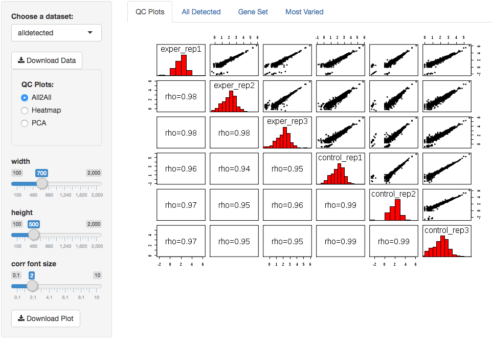

*****************
Quick-start Guide
*****************

This guide is a quick walkthrough for the DESeq Browser from start to finish.

Getting Started
===============

First off, we need to head to the DEBrowser webpage at this url:

http://debrowser.umassmed.edu/

Alternatively, if you have the R package installed, you can call these R commands:

library(debrowser)

startDEBrowser()

Once you've made your way to the website, you will be greeted with this tab on the left:

.. image:: debrowser_pics/input_tab.png
	:align: center
	
To begin the DESeq process, you will need to select your Data file (CSV format) to be analyzed using DESeq.
If you do not have a dataset to use, you can use this `demo set`_ or you can select to use the built in demo
by clicking on the 'Load Demo!'.

.. _demo set: http://bioinfo.umassmed.edu/content/workshops/material/data.tsv

Once you've selected your file and the upload has completed, you will then be shown the samples listed within your
file uploaded as well as multiple options.

.. image:: debrowser_pics/file_load.png
	:align: center

The first option, 'Go to DE Analysis', takes you to the next step within the DESeq workflow.
In order to run DESeq on your input data you first need to select which samples will go into your
conditions.  You can run multiple condition comparisons and view the results seperately as well.
To remove samples from a condition, simply select the sample you wish to remove and hit the delete/backspace key.

.. image:: debrowser_pics/de_analysis.png
	:align: center

The second option, 'Go to QC plots!', takes you to a page where you can view quality control metrics on your data input.
The page opens with an all-to-all plot displaying the correlation between each sample.  Left of this plot is a panel which
contains various parameters to alter the look of your plot such as width and height.  In addition to the all-to-all plot,
you can also view a heatmap representation of your data as well as a Principal Component Analysis (PCA) plot by selecting
the specific plot option on the left panel under 'QC Plots'.  You can also select the type of clustering and distance method for
the heatmap produced to further customize your quality control measures.

	
.. image:: debrowser_pics/intro_qc_heatmap.png
	:align: center
	
.. image:: debrowser_pics/intro_qc_pca.png
	:align: center

You can also view specific tables of your input data such as all detected genes, search for a specific geneset
where you input a comma-seperated list of genes or regex terms to search for, or view the most varied samples based
on user input parameters  To view these tables, you must select the tab as well as the dataset from the dropdown menu on the left panel.
By selecting your prefered dataset, additional options will also be made to you on the left panel for further customization
such as the genelist.

.. image:: debrowser_pics/intro_genelist.png
	:align: center

.. image:: debrowser_pics/intro_varied.png
	:align: center
	
Once you are happy with your dataset and have selected your conditions within the 'DE Analysis' section,
you can then hit 'Submit!' to begin.

The Main Plots
==============

After clicking on the 'Submit!' button, DESeq2 will analyze your comparisons
and store the results into seperate data tables.  Shiny will then allow you
to access this data, with multiple interactive features, at the click of a
button.  It is important to note that the resulting data produced from DESeq
is normalized. Upon finishing the DESeq analysis, a tab based menu will appear
with multiple options.

.. image:: debrowser_pics/info_tabs.png
	:align: center

The first tab, the 'Main Plots' section, is where you will be able to view
the interactive results plots.  Plot choices include:

Scatter plot

.. image:: debrowser_pics/scatter_plot.png
	:align: center

Volcano plot

.. image:: debrowser_pics/volcano.png
	:align: center
	
MA plot

.. image:: debrowser_pics/ma.png
	:align: center
	
You can hover over the scatterplot points to display more information about the point selected.
A few bargraphs will be generated for the user to view as soon as a scatterplot point is hovered over.

.. image:: debrowser_pics/bargraph.png
	:align: center
	
.. image:: debrowser_pics/barplot.png
	:align: center
	
You can also select a specific region within the scatter plot and zoom in on the selected window.

.. image:: debrowser_pics/scatter_plot_selection.png
	:align: center
	
Once you've selected a specific region, a new scatterplot of the selected area will appear on the left

.. image:: debrowser_pics/scatter_plot_zoom.png
	:align: center
	
You also have a wide array of options when it comes to fold change cut-off levels, padj cut-off values,
which comparison set to use, and dataset of genes to analyze.

.. image:: debrowser_pics/filters.png
	:align: center

If you can select the type of plot at the bottom of the filter tab.

.. image:: debrowser_pics/main_plots.png
	:align: center
	
You can download the results in CSV or TSV format by selecting your 'File type' and clicking the 'download' button once you've ran DESeq.
You can also download the plot or graphs themselves by clicking on the gear in the upper-left corner of each plot or graph.

Quality Control Plots
=====================

Selecting the 'QC Plots' tab will take you to the quality control plots
section.  These QC plots are very similar to the QC plots shown before
running DESeq, however the dataset being used here depends on the one
you select on the left menu.  In addition to the all-to-all plot shown
within the previous QC analysis, users can also view a heatmap and PCA
plot of their analyzed data by selecting the proper plot on the left
menu.  You can also choose the appropriate clustering and distance method you would
like to use for this heatmap just abot the plot just like in the previous QC section.

For additional information about the clustering methods used, you can consult `this website`_.

.. _this website: http://www.inside-r.org/r-doc/stats/hclust

For additional information about the distance methods used, you can consult `here`_.

.. _here: http://www.inside-r.org/r-doc/stats/dist

For distances other than 'cor', the distance function defined will be ( 1 - (the correlation between samples)).

Each qc plot also has options to adjust the plot height and width, as well as a download button for a pdf output located above each plot.

GO Term Plots
=============

The next tab, 'GO Term', takes you to the ontology comparison portion of
DEBrowser.  From here you can select the standard dataset options such as
p-adjust value, fold change cut off value, which comparison set to use, and
which dataset to use on the left menu.  In addition to these parameters, you
also can choose from the 4 different ontology plot options: 'enrichGO',
'enrichKEGG', 'Disease', and 'compareCluster'.  Selecting one of these plot
options queries their specific databases with your current DESeq results.

.. image:: debrowser_pics/go_plots_opts.png
	:align: center
	
Your GO plots include:

* enrichGO - use enriched GO terms
* enrichKEGG - *currently under construction*
* compareClusters - comparison of your clustered data
* Disease - enriched for diseases

After you select what to analyze in your GO plot, then you can select aditional parameters for your GO analysis.

.. image:: debrowser_pics/go_opts.png
	:align: center

The types of plots you will be able to generate include:

* Summary - bar plot
* GOdotplot - dot plot

Once you have adjusted all of your parameters, you may hit the submit button in the top right and then wait

for the results to show on screen!

Example Summary plot:

.. image:: debrowser_pics/go_summary.png
	:align: center

Example GOdotplot:

.. image:: debrowser_pics/go_dot_plot.png
	:align: center
	
Data Tables
===========

The data generated is also sorted based on the following datasets:

* All Detected
* Up Regulated
* Down Regulated
* Selected scatterplot points

.. image:: debrowser_pics/datatable.png
	:align: center
	
The tables contain the following information:

* ID - The specific gene ID
* Sample Names - The names of the samples given and they're corresponding tmm normalized counts
* Conditions - The log averaged values
* padj - padjusted value
* log2FoldChange - The Log2 fold change
* foldChange - The fold change
* log10padj - The log 10 padjusted value
