*****************
Quick-start Guide
*****************

This guide is a quick walkthrough for the DESeq Browser from start to finish.

Getting Started
===============

First off, we need to head to the DEBrowser webpage at this url:

http://debrowser.umassmed.edu/

Alternatively, if you have the R package installed, you can call these R commands:

library(debrowser)
library(shiny)
runApp()

Once you've made your way to the website, you will be greeted with this tab on the left:

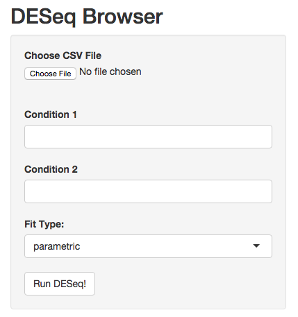
	
To begin the DESeq process, you will need to select your Data file (CSV format) to be analyzed using DESeq.

If you do not have a dataset to use, you can use this `demo set <http://bioinfo.umassmed.edu/content/workshops/material/data.tsv>`

This selection is under the 'Choose CSV File'.

Once you've selected your file and the upload has completed, you will then be able to select your conditions

in which you wish to compare using DESeq.

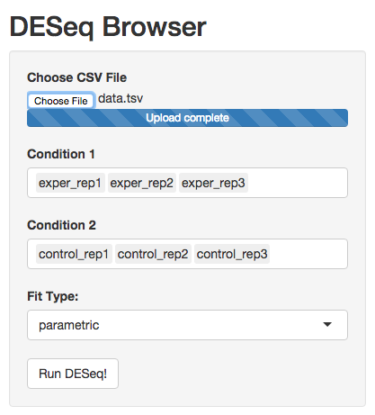
	
.. image:: debrowser_pics/condition_selection.png
	:align: center
	
Once you've selected your conditions, you can then hit 'Run DESeq!' to begin.

Analyzing The Results
=====================

Once DESeq has finished and the results have been uploaded into DEBrowser, the initial scatterplot of

the results will be uploaded.

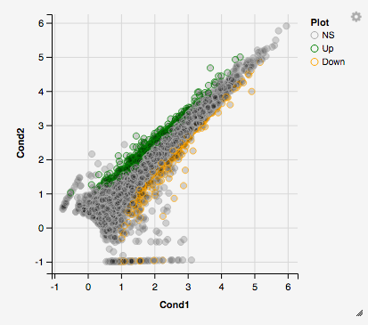
	
You can hover over the scatterplot points to display more information about the point selected.

A few bargraphs will be generated for the user to view as soon as a scatterplot point is hovered over.

.. image:: debrowser_pics/bargraph.png
	:align: center
	
.. image:: debrowser_pics/barplot.png
	:align: center
	
You can also select a specific region within the scatter plot and zoom in on the selected window.

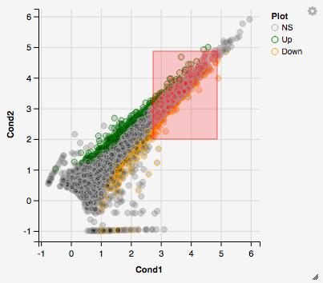
	
Once you've selected a specific region, a new scatterplot of the selected area will appear on the left

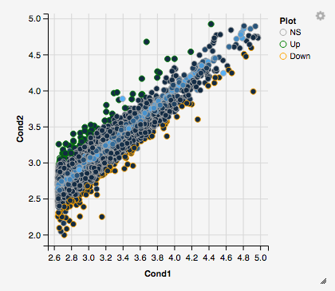
	
You also have a wide array of options when it comes to fold change cut-off levels, padj cut-off values,

and up/down regulated genes.

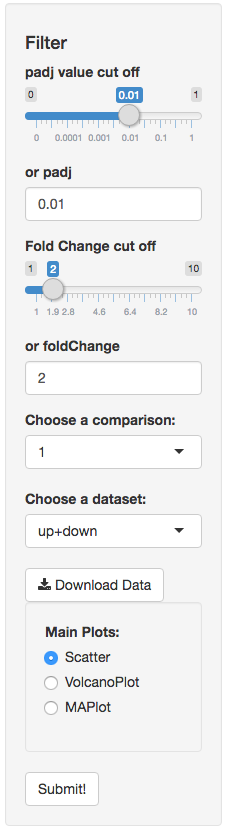

If you can select the type of plot at the bottom of the filter tab.

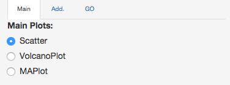
	
The default is a Scatter plot, but you can also choose from a Volcano plot and a MA plot.

.. image:: debrowser_pics/volcano.png
	:align: center
	
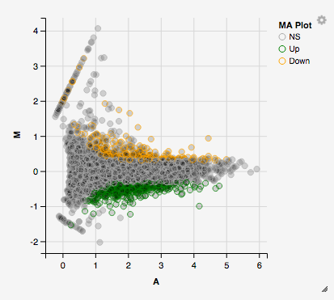

You can download the results in CSV or TSV format by selecting your 'File type' and clicking the 'download' button once you've ran DESeq.

Quality Control Plots/Tables
=======================

After DESeq has run, and you've had some time to play with the initial plots generated, You may notice the additional tabs above the plots.

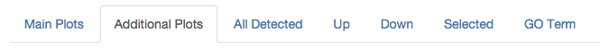
	
These tabs display qc plots or tables based on your current padj/fold-change cut-off values.

By selecting qc plots, you will be shown qc plots based on the 'QC Plots' selection on the left tab.

QC plots will start off on the All2All plot.  To determine which qc plot you will be viewing, you

can select the 'Add.' tab within the filters box to change the types.

.. image:: debrowser_pics/add_plots_opts.png
	:align: center

The first selection, 'All2All', displays an all-to-all plot of your conditions slected.  As you change the padj and

fold-change cutt-off values, the data in these plots will also change!

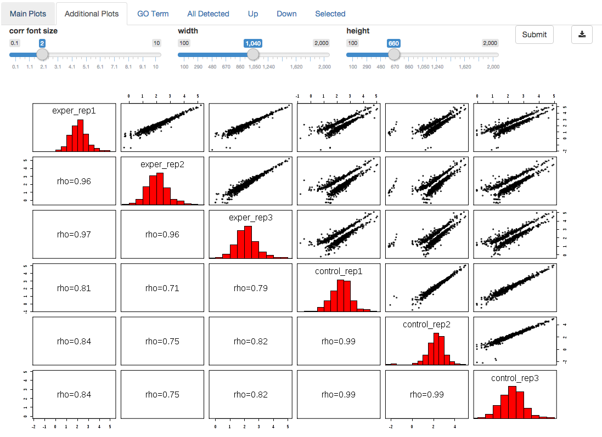
	
The second qc plot is the heatmap generated based on your dataset.

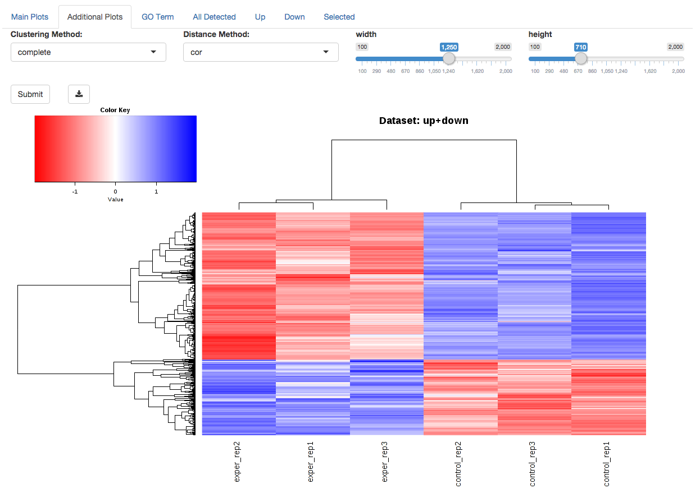

You can also choose the appropriate clustering and distance method you would like to use for this heatmap just abot the plot.

For additional information about the clustering methods used, you can consult `this <http://www.inside-r.org/r-doc/stats/hclust>`_ website.

For additional information about the distance methods used, you can consult `this <http://www.inside-r.org/r-doc/stats/dist>`_ website.  For distances other than 'cor', the distance function defined will be ( 1 - (the correlation between samples)).

The third plot, the PCA plot (Principal Component Analysis)

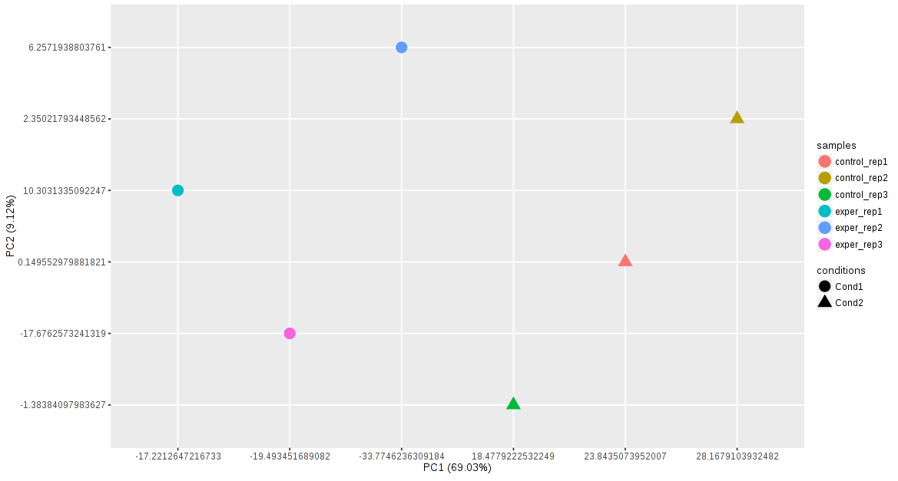

Each qc plot also has options to adjust the plot height and width, as well as a download button for a pdf output located above each plot.

In qc to these exciting qc plots, you also have access to the data generated within table form.

The data generated is also sorted based on the following datasets:

* All Detected
* Up Regulated
* Down Regulated
* Selected scatterplot points

.. image:: debrowser_pics/datatable.png
	:align: center
	
The tables contain the following information:

* ID - The specific gene ID
* Sample Names - The names of the samples given and they're corresponding tmm normalized counts
* Conditions - The log averaged values
* padj - padjusted value
* log2FoldChange - The Log2 fold change
* foldChange - The fold change
* log10padj - The log 10 padjusted value

GO Term Tab
===========

The final tab gives the user access to specific GO plots.  Make sure that if you're interested in the GO plots,

to switch the tab within the filter box to 'GO'

.. image:: debrowser_pics/go_plots_opts.png
	:align: center
	
Your GO plots include:

* enrichGO - use enriched GO terms
* enrichKEGG - *currently under construction*
* compareClusters - comparison of your clustered data
* Disease - enriched for diseases

After you select what to analyze in your GO plot, then you can select aditional parameters for your GO analysis.

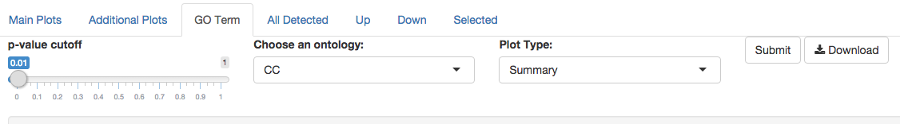

The types of plots you will be able to generate include:

* Summary - bar plot
* GOdotplot - dot plot
* enrichMap - *currently under construction*

Once you have adjusted all of your parameters, you may hit the submit button in the top right and then wait

for the results to show on screen!

Example Summary plot:

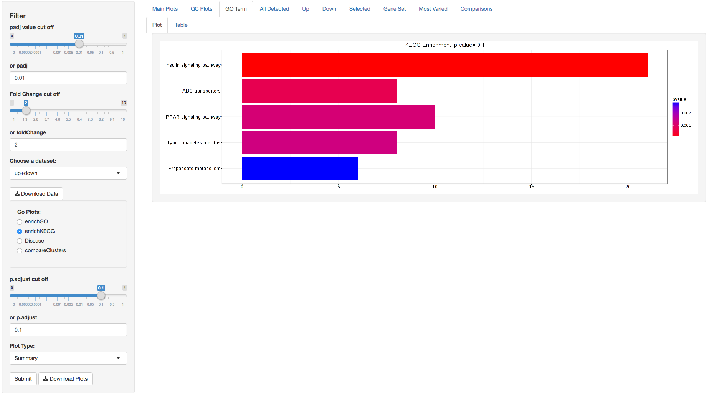

Example GOdotplot:

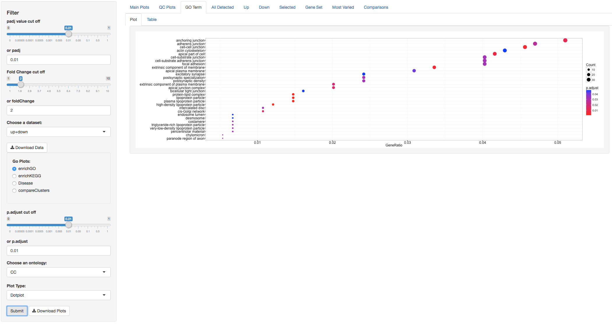
	
Now you can enjoy all of the analysis tools within DEBrowser!
