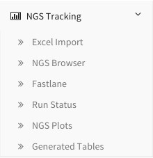

**********************
DEBrowser Access Guide
**********************

This guide is a quick guide for the DEBrowser within dolphin.

Accessing DEBrowser
===================

First, make sure to have an instance of dolphin available (see Dolphin Docker) as well as an account for the dolphin interface.

Once logged in, click on the 'NGS Tracking' tab on the left, then click on 'DEBrowser'.

	
This will bring you to the DEBrowser section within dolphin.  You can load in rsem/mRNA/tRNA results from runs with the corresponding results straight into the browser from the reports page of that run.  Additionally, you can also load in custom generated rsem/mRNA/tRNA tables created through dolphin from the tables generated section.  For more information on how to load this data into DEBrowser, see their NGS guides for more information.

For a more detailed guide on DEBrowser itself, please visit the DEBrowser section within <dolphin.readthedocs.com>